Here's a combined summary of the key points from all provided React Native code snippets:

### General:
- The code sets up a basic navigation structure for a React Native app using React Navigation.
- It organizes five screens ('Home', 'Fitness', 'Nutrition', 'Mental Well-Being', 'Community') within a Stack Navigator.

### Import Statements:
- Imports React, StyleSheet, NavigationContainer, createStackNavigator, and individual screen components from their respective packages.

### Stack Navigator Setup:
- Utilizes createStackNavigator from React Navigation to create a Stack Navigator.
- Sets initialRouteName to 'Home'.

### App Component:
- Defines the App component as a functional component.
- Wraps the Stack.Navigator with a NavigationContainer, the required root component for navigation.
- Defines multiple Stack.Screen components inside Stack.Navigator, each representing a screen in the app.

### FitnessPlans Component:
- Manages state for loading and workouts using the useState hook.
- Utilizes the useEffect hook to simulate fetching workout data from an API.
- Renders an ActivityIndicator while data is being fetched.
- Displays fetched workout data using a FlatList component.

### MentalWellBeingScreen Component:
- Renders a screen titled "Mental Well-Being" with buttons to start meditation and mindfulness exercises.
- Uses functions `startMeditation` and `startMindfulness` to handle button presses.

### CommunityScreen Component:
- Renders a screen titled "Community" with buttons to share achievements, challenges, and tips.
- Uses functions `shareAchievement`, `shareChallenge`, and `shareTip` to handle button presses.

### HomeScreen Component:
- Displays a welcome message and buttons to navigate to different sections of the app (Fitness, Nutrition, Mental Well-Being, Community).
- Uses the `navigation.navigate` method to navigate to respective screens.

### Stylesheet:
- Defines a StyleSheet but is not used in this code snippet. It's a common practice to define styles using StyleSheet.create for better performance and organization.

These components collectively form part of a health and wellness app, providing functionality related to fitness plans, mental well-being, nutrition guidance, and community engagement. The code demonstrates the usage of React Native components and navigation to create an interactive user interface.
### Screenshots

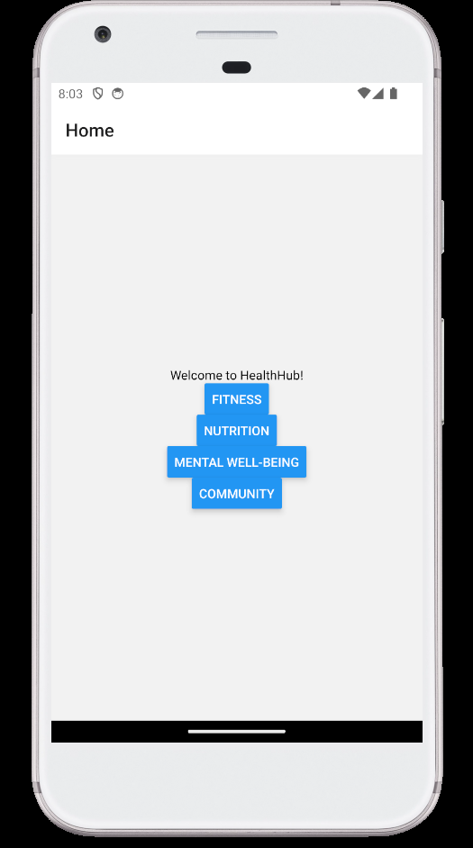
HealthHub's HomeScreen: Navigate wellness effortlessly.

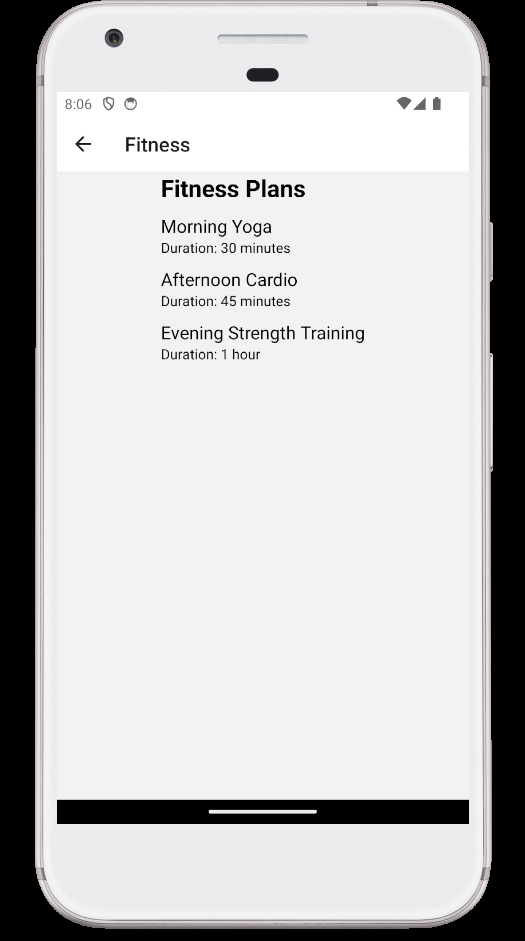

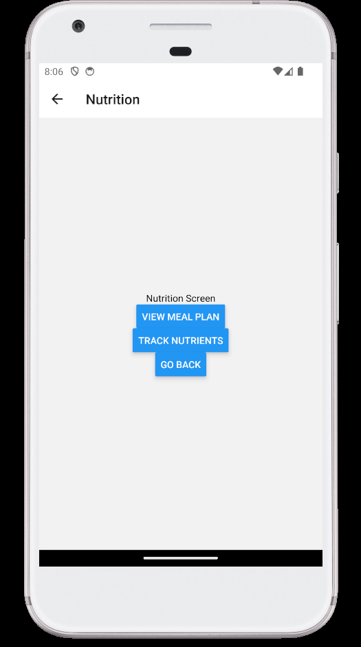

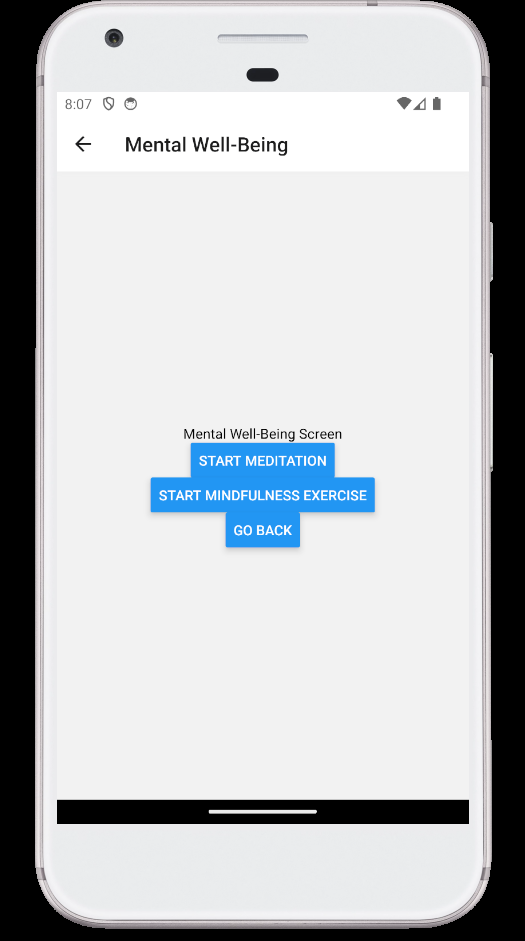

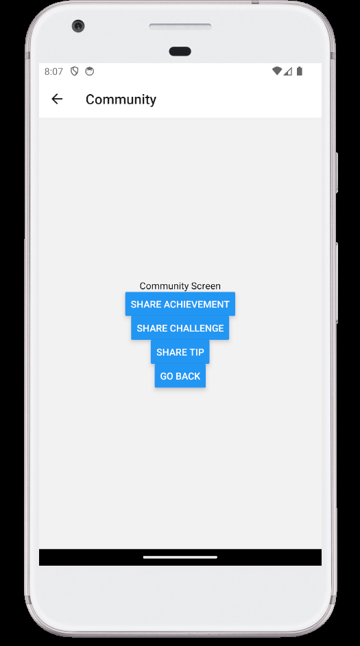

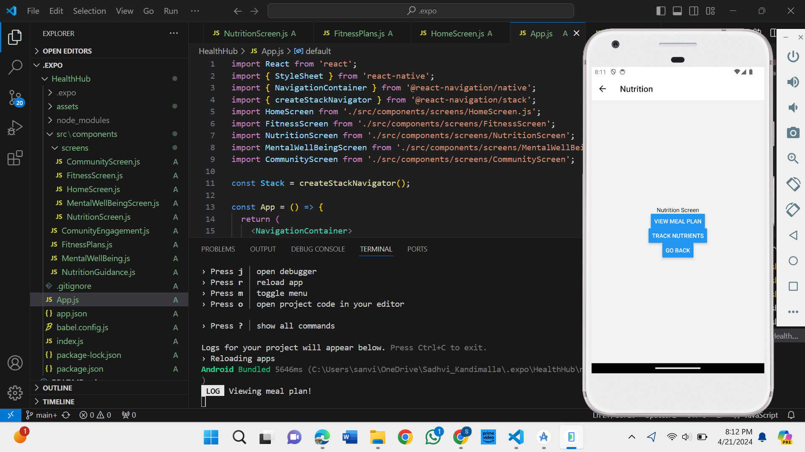

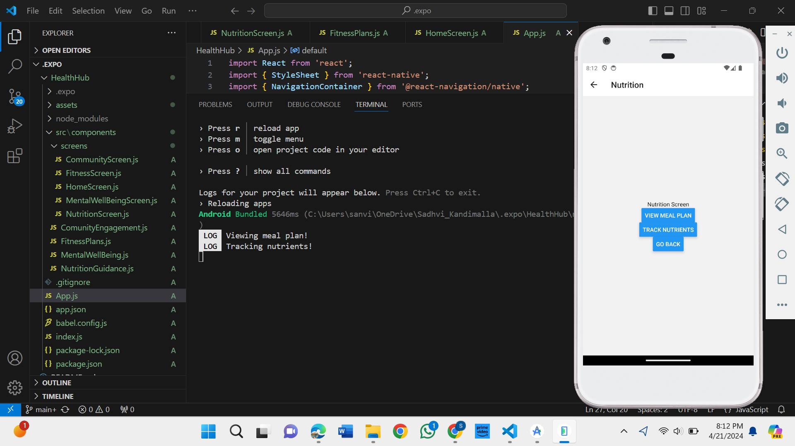

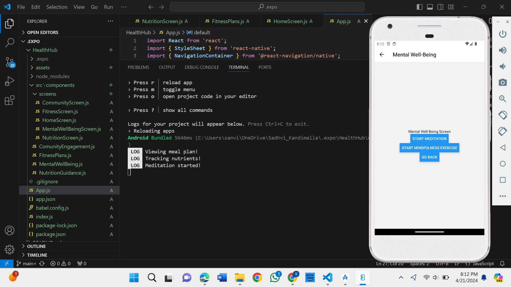

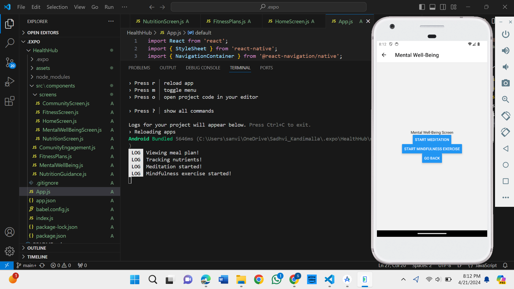

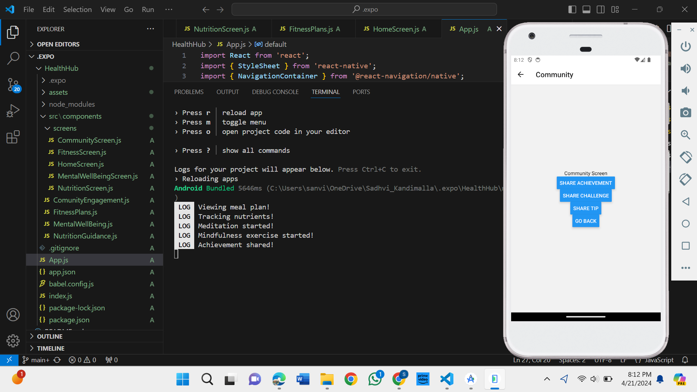

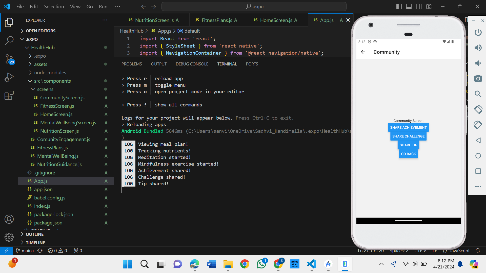
